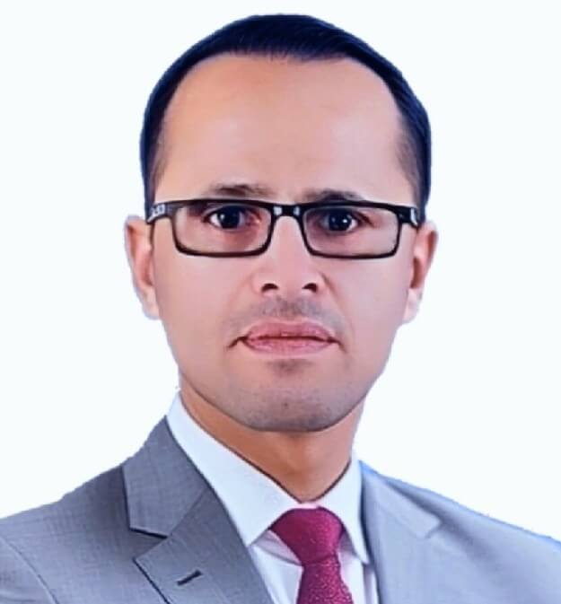

# عيادة د. مختار الشرعبي - ENT Clinic

## نبذة عن العيادة
عيادة د. مختار الشرعبي هي عيادة متخصصة في **جراحات وتشخيص أمراض الأنف، الأذن، الحنجرة، الجيوب الأنفية، السمع، والتخاطب**.  
أفضل دكتور ENT في تعز، مع خبرة واسعة في تشخيص وعلاج مشاكل الأنف والأذن والحنجرة للأطفال والكبار.

## الدكتور مختار عبده الشرعبي

- **الاسم:** دكتور مختار الشرعبي  
- **الوظيفة:** استشاري جراحة الأنف والأذن والحنجرة  
- **الوصف:** متخصص في أمراض وجراحات الأنف، الأذن، الحنجرة، الجيوب الأنفية، السمع، والصداع  
- **الموقع الرسمي:** [https://drmsharabi.github.io/ENTclinic](https://drmsharabi.com/)  
- **رقم الهاتف:** +967777421224 ، +967730433592  
- **العنوان:** الحوبان، ركن مفرق ماوية، مبنى مختبرات دار الصحة، تعز، اليمن  
- **روابط التواصل الاجتماعي:**  
  - [Facebook](https://www.facebook.com/profile.php?id=100082372405434)  
  - [YouTube](https://youtube.com/@ENTsharabi)  
  - [Instagram](https://www.instagram.com/dr.mokhtar_alsharabi)  
  - [X/Twitter](https://x.com/Dr_Alsharaabi)  
  - [TikTok](https://www.tiktok.com/@dr_mokhtar_sharabi)

## الترخيص
جميع الحقوق محفوظة لعيادة د. مختار الشرعبي © 2026
